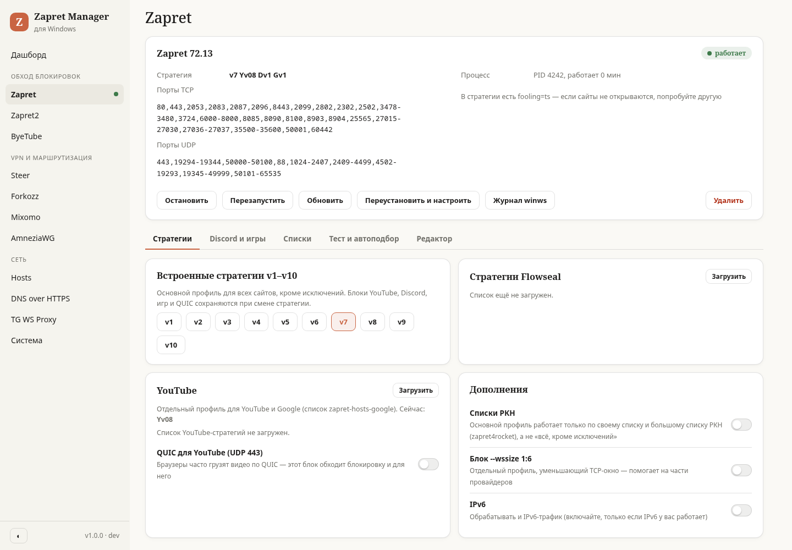
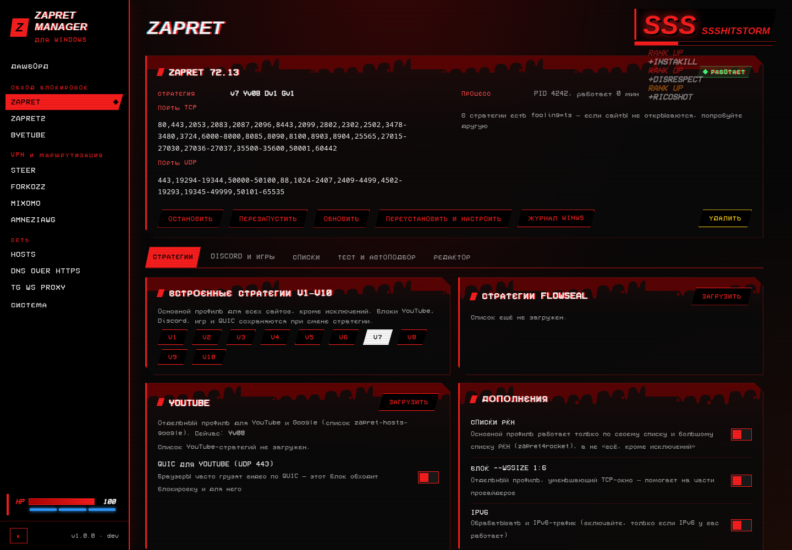

# Zapret Manager для Windows

Неофициальный порт [Zapret Manager by StressOzz](https://github.com/StressOzz/Zapret-Manager) (OpenWrt: консольное меню `zms` + LuCI-панель) на Windows.
Один `ZapretManager.exe` без зависимостей: служба Windows + веб-панель на `127.0.0.1` + консольное меню.

> Обход DPI-блокировок (YouTube, Discord, сайты, игры), шифрованный DNS, hosts, прокси для Telegram, AmneziaWG/WARP и выборочный VPN — всё в одной панели, как на роутере.

| Claude | ULTRAKILL |
|---|---|
|  |  |

## Возможности

| Раздел | Что делает | Как устроено на Windows |
|---|---|---|
| **Zapret** | стратегии v1–v10, Flowseal, YouTube (Yv), QUIC, Discord (Dv1–17), игры (Gv1–4, Xtreme), списки РКН, `--wssize`, `#nochange`, редактор | `winws.exe` (bol-van/zapret) + WinDivert; формат стратегий совместим с роутером (импорт/экспорт) |
| **Тест и автоподбор** | перебор стратегий на заблокированных сайтах, свои домены и стратегии, ежедневный автоподбор | встроенный тестер и планировщик службы |
| **Списки** | исключения (с автообновлением), свой список, YouTube/Google | `%ProgramData%\ZapretManager\lists` |
| **Zapret2** | winws2 с lua-стратегиями | bol-van/zapret2 |
| **Hosts** | готовые блоки (ИИ-сервисы, Instagram, Telegram Web, Spotify…), GeoHide, редактор | `drivers\etc\hosts` |
| **DNS over HTTPS** | Cloudflare, Google, Quad9, Comss, Xbox DNS, GeoHide, Яндекс, свой; bootstrap; принудительный DNS | свой DoH-прокси на `127.0.0.1:53` (Win10/11) или встроенный DoH Windows 11 |
| **TG WS Proxy** | Go (SOCKS5/MTProto) и Rust (MTProto + FakeTLS), ссылки `tg://`, доступ из локальной сети | Windows-сборки проектов d0mhate и valnesfjord |
| **AmneziaWG** | туннели, бесплатный WARP с маскировкой (Jc/Jmin/Jmax, I1), автоподбор точки входа | клиент amneziawg-windows |
| **ByeTube** | YouTube через ByeDPI, 6 пресетов, подбор стратегии | `ciadpi.exe` + PAC-файл |
| **Steer / Forkozz / Mixomo** | сервисы через WARP, секции с VPN-ссылками/подписками/интерфейсами, своя конфигурация mihomo | один движок **mihomo** в режиме TUN |
| **Обновление** | кнопка «Обновить» прямо в панели: скачивает новую версию с GitHub Releases, подменяет exe и перезапускает службу; обновление компонентов из таблицы версий | |
| **Конфликты** | находит другой zapret / GoodbyeDPI (процессы и службы Flowseal и др.) и предлагает отключить одной кнопкой | службы → ручной запуск, процессы останавливаются |
| **Система** | QUIC-блок в брандмауэре, IPv6, Expert mode, зеркала GitHub, версии, журналы, полное удаление | |

Оформление: **Claude** (светлая/тёмная/как в системе) и **ULTRAKILL** — кровь, брызги, тряска, шкала стиля D → ULTRAKILL, HP, шрифт VCR OSD Mono. Арты игры по кнопке скачиваются из Steam на ваш ПК (в репозиторий не входят).

## Установка

1. Скачайте `ZapretManager.exe` из [Releases](../../releases) (или соберите сами).
2. Запустите — Windows спросит права администратора. Программа скопирует себя в `%ProgramData%\ZapretManager`, зарегистрирует службу и откроет панель.
3. На вкладке **Zapret** нажмите «Установить и настроить» — поставится winws, стратегия v7, блоки hosts и игровая стратегия.

Команды: `ZapretManager.exe open | menu | status | install | uninstall | run`.
Удаление: «Система → Удалить Zapret Manager полностью» — DNS, прокси и правила брандмауэра возвращаются как было.

## Сборка

```bash
GOOS=windows GOARCH=amd64 go build -trimpath -ldflags "-s -w" -o ZapretManager.exe ./cmd/zapret-manager
```

Разработка на Linux: `go run ./cmd/zapret-manager run` — dev-режим, системные действия Windows имитируются, панель на `http://127.0.0.1:17580` (токен — `devroot/state/token`).

Тесты совместимости с роутером (стратегии сравниваются байт-в-байт с оригинальными shell-функциями):

```bash
ZM_FS_DIR=… ZM_FS_REF=… go test ./internal/zapret -run FlowsealParity
ZM_BASE=$(mktemp -d) ZM_OFFLINE=1 ZM_HARNESS=… ZM_YT=… ZM_FS_REF=… go test ./internal/zapret -run RouterParity
ZM_MIHOMO=/path/to/mihomo go test ./internal/routing -run GenerateValid
```

## Безопасность

Панель слушает только `127.0.0.1`, вход по токену из файла, доступного лишь администраторам; проверка `Host` (DNS-rebinding), `SameSite=Strict` + заголовок `X-ZM` против CSRF. Все дочерние процессы привязаны к Job Object — если служба упадёт, winws/mihomo завершатся вместе с ней.

## Благодарности и лицензии

- **StressOzz** — автор [Zapret Manager](https://github.com/StressOzz/Zapret-Manager): логика, наборы стратегий v1–v10/Dv/Gv, блоки hosts и идеи этого порта. Это неофициальный порт; если автор против — свяжитесь, всё поправим.
- [bol-van/zapret](https://github.com/bol-van/zapret), [zapret2](https://github.com/bol-van/zapret2), [Flowseal/zapret-discord-youtube](https://github.com/Flowseal/zapret-discord-youtube), [hufrea/byedpi](https://github.com/hufrea/byedpi), [MetaCubeX/mihomo](https://github.com/MetaCubeX/mihomo), [amnezia-vpn](https://github.com/amnezia-vpn), [itdoginfo/allow-domains](https://github.com/itdoginfo/allow-domains), [Internet-Helper/GeoHideDNS](https://github.com/Internet-Helper/GeoHideDNS), TG WS Proxy от d0mhate и valnesfjord — компоненты скачиваются с их релизов при установке.
- Шрифты: VCR OSD Mono (Riciery Leal, бесплатный), Pixelify Sans (SIL OFL 1.1, `internal/web/ui/fonts/OFL-PixelifySans.txt`).
- ULTRAKILL — товарный знак New Blood Interactive / Arsi «Hakita» Patala. Скин — фанатское оформление, игровые арты в проект не входят.
- Собственный код проекта — лицензия MIT (см. `LICENSE`).

---

🤖 Проект полностью сгенерирован с помощью [Claude](https://claude.ai) (Claude Code, модель Claude Opus) по заданию автора репозитория.
